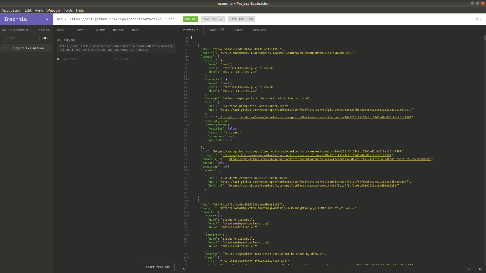
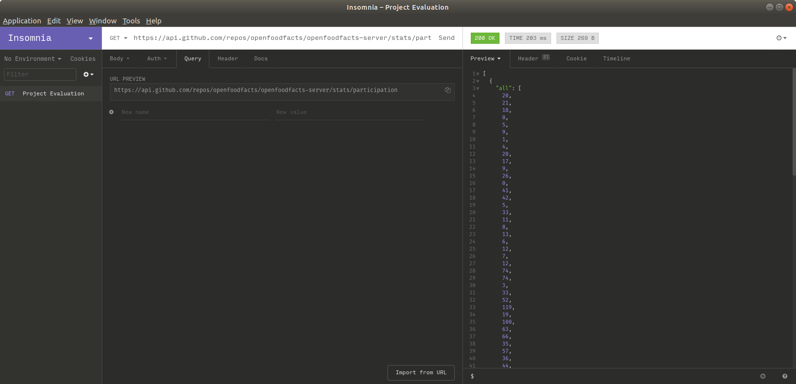

Today was disappointing to the maximum degree. I had taught myself to persevere in the face of technical difficulties and to march on despite the onslaught. 
That lesson did not help me. In the end, I realized it was better for me to surrender. Surrendering to the fate that lied ahead of me felt great, it felt liberating; perhaps understanding that paradox is the key here. 

## Grade His Work
When I was young, I would often grade my father's students' papers. I am not particularly fond of these memories; the people I was correcting were older than me while I had a better command over the English language, and I would leave their papers in red markings from one end to the other. Getting humiliated by someone younger than me in age and experience is the least of my concerns. My concern is to see myself accept defeat. Growing tired of this facade of tenacity has rendered me weak, and tools that are meant to ease my chores have only made it more strenuous. 

Evaluating projects, I am convinced, is the most sophisticated way to gain insight into a project's condition. It tells us whether or not it is worth getting involved in a project, whether the project will reward us with the gratification we need to prevent ourselves from burnout. Taking a comprehensive metric of last opened issues, length of issue lifetime, last commit to the repository, and maintainer interaction play essential roles in determining the answer to that critical question. With that in mind, I set out to evaluate three prominent projects. Namely:
1. OpenFoodFacts Server
1. Netflix Conductor
1. DOxygen

Also, how they broke me. 

## Attempts at Laziness
I firmly believe that to achieve something worthwhile in the realm of computer science, automation, and delegation of menial tasks, one must be lazy. So, I was.

When the evaluations asked me to evaluate the general codebase, I was sometimes perplexed about their effectiveness. It has always been a bete noire of mine that documentation can be titanic, yet would convey so little information. For particular ones on my list, I was gobsmacked to see how many pages of documentation I had to sift through to reach my general use case. If feature creep is the term to define a piece of software that has no direction, then I dub this documentation overload. From complicated scripts to running wretched Apache servers, some of these projects were built as though they wanted newcomers to turn tail as soon as they encountered them. 

When it came to questions of measuring activity, though, my laziness started to show. Laziness is a state of mind for me. I comfortably settle into it, bask in it, and absorb it. 

I realized with a quick query to Professor Google that the best way to evaluate and GitHub repository was to utilize its sophisticated API. So, I brought out my API testing tool and made all sorts of GET requests to get what I want. It was quite clever until it failed me. 

One of the factors to be taken into consideration was the number of weekly contributions to the repository for 12 weeks. After two days of pondering the question, I came up with a small script to output the number in Node.js. Alas! When I re-read the question, I realized the task was much easier than I had first thought and all my efforts at automation, computing prowess, and world domination were in vain.

So, I put my mind together once more to produce an URL that would return the solution to all my problems. They say that there is an API for everything; there is nothing I hoped to be true more than this. Thankfully, when I sent a GET request with `https://api.github.com/repos/openfoodfacts/openfoodfacts-server/stats/participation`, it responded with the solution to all my problems. 

## Evaluate Thyself
Perhaps, it was never about project evaluation. When I became obsessed about proving myself that I could outsmart tedious gruntwork, I fell into the same quagmire I fell into when my dad's students started leaving one by one. To evaluate others, I paused evaluating myself. So I fell into procrastination. Always taking the easy way out, not realizing it never is. 
