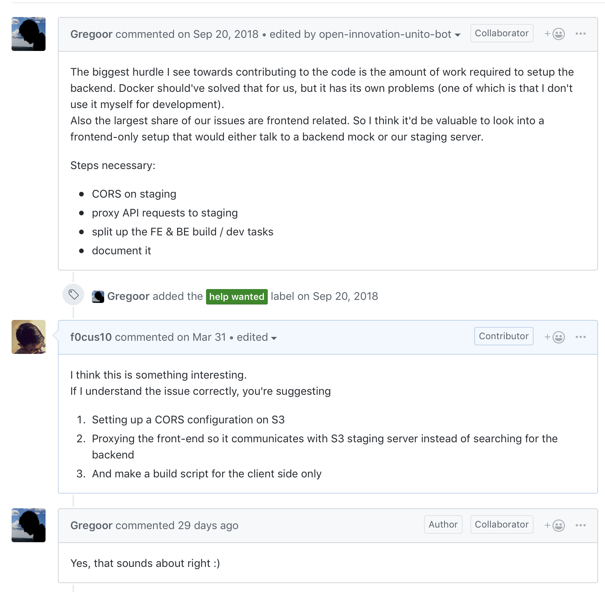
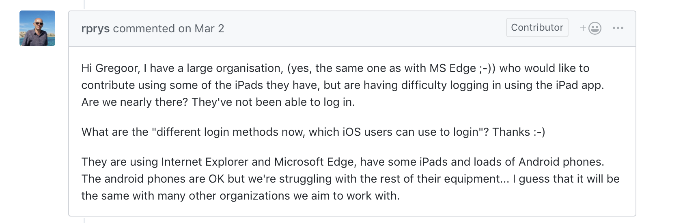

One of the tenets of open-source software development that I always try to look up to is the communal bond. A community feels the need to come together to create something wonderful and in doing so, shifts the tides of software engineering as a paradigm. See, during my younger years I used to view software engineering -- perhaps, engineering in general -- to be a monotonous endeavour. I would imagine someone churning the gears of a car by themselves whilst musing about the intricacies of different techniques of using the wrench. Although some of that holds true in my mind till today, open-source software development has allowed me to zoom out and see all the scientific and not-so-scientific way software is produced. It is with great sadness, then, that I must report about my crisis with Mozilla's latest undertaking. 

## Hypocrisy
I am registered into Mozilla's newsletters, I own multiple Mozilla accounts -- I will explain why in the blogs that follow -- and I frequent their website. Why? Because I believe in their mission. I truly love to see a non-profit organization enabling communities to build tools to use technologies like the internet the way they want to. I am both astonished and proud of the way Firefox has kept the competition going against Google's Chrome browser which is infested with user telemetry. So, in all honesty, I am not a hater -- I even applied to work at Mozilla for crying out loud.

Now, in these newsletters and website visits I would regularly notice references to Common Voice and when I first heard about it a year ago, I was eager to contribute; sometimes anonymously, and at other times through my account. In fact, it was my favorite downtime activity for a while and I would be on my couch validating voices one after another. Now, before you think I am a creep, I would do this to enrich my listening skills -- and that is one of the things volunteers receive in return for their contribution. I also found it valuable, since I am actively learning French, to validate French sentences on the app. 

Thus, it came as a complete surprise and disappointment when I noticed the repository was -- in reality -- managed by only one person. Said person was always commenting on the new bugs, deciding on the direction of the application, troubleshooting, making derivative tickets (tickets that arise from attempting to solve other tickets), and accept Pull Requests.

For a project that is constantly on the frontpages, it is a shame that Mozilla has designated -- this is an assumption -- only one person to work on the whole repository which consists of a TypeScript backend, React+TypeScript web frontend, and iOS and Android wrappers. For other companies, there are entire teams dedicated to these tasks.

## Disbelief
As I was perusing through the issues, trying my best to reproduce them, and discuss approaches, I was "left on seen" multiple times; I say this in quotes because I am not entirely sure if anyone even noticed my comments. This was perhaps multiplied manifold by a recent article from Mozilla describing the importance of volunteer appreciation in open-source projects. It soon becomes exhausting when a company propels itself forward through others' contributions and does not even offer a "thank you". 

Without doubt, I do not expect from a Non-Profit the same level of indulgence I expect from a Fortune 500. But, my passion -- and consequently, my belief -- started to dwindle when I noticed the disparity between some of Mozilla's other projects (e.g. Firefox Send, Hubs) and Common Voice. Through the bugs, I noticed people trying to donate to the datasets through communal initiative -- I saw someone saying they were arranging their coworkers to get to donate voices through company iPads but could not do so properly because of issues with iOS and the main Collaborator remarking that there are no iOS developers in the community. 

## Hindsight
But I do not lose hope in open-source. One of the advantages of open-source is that even if a project is dying, it can be passed on to the next person. And if people are willing, the forked version becomes the main version. The community will find a way to saitiate their needs, whether it be through active participation or choosing another project over the current one. 

This hope of mine is exponentiated through articles from the likes of Laura Hilliger, who discusses the different types of [personalities in open source](https://opensource.com/open-organization/18/11/design-communities-personality-types?utm_campaign=intrel). Hilliger uses her experience at Mozilla to discuss her findings about personality traits and found them to be rarer than the general population.
Although I hold my reservations about Briggs-Myers types, one of the things I appreciate as a borderline introvert is her suggestion for personal outreach to introverts. Interestingly enough, reading through the article made me see Common Voice's shortcomings. Where Hilliger is asking maintainers to be flexible and even repetitive in explaining certain ideas (obviously through different approaches), Common Voice produced issues like "See issue #xyz"; that's it, the whole issue body just consisted of a reference to a previous issue's discussion. Bleh.

Despite sharing a touch of irony, Mozilla could definitely use some of these lessons from this article and incorporate it in every project. Although prioritization matters and Common Voice matters more to me than other Mozilla projects -- as Hilliger notes in her article -- there should be a certain level of interaction a volunteer can reasonably expect from the repository.